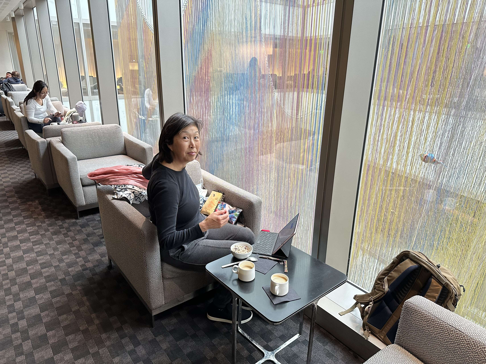
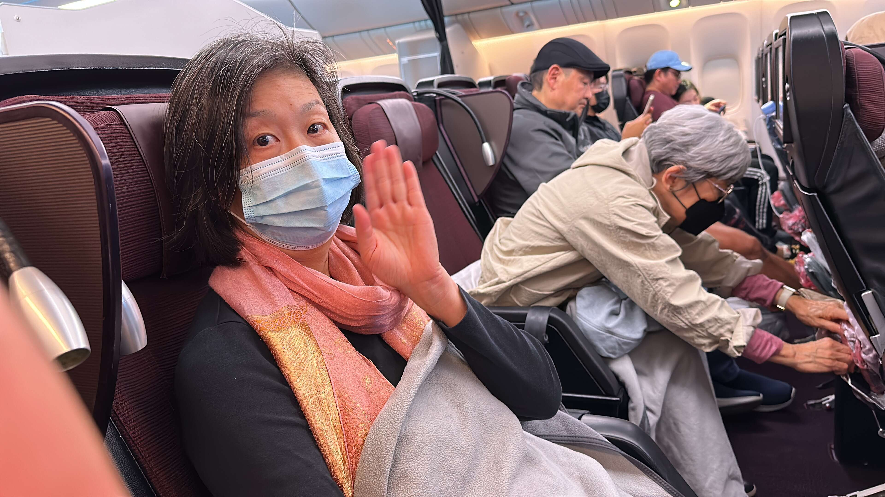
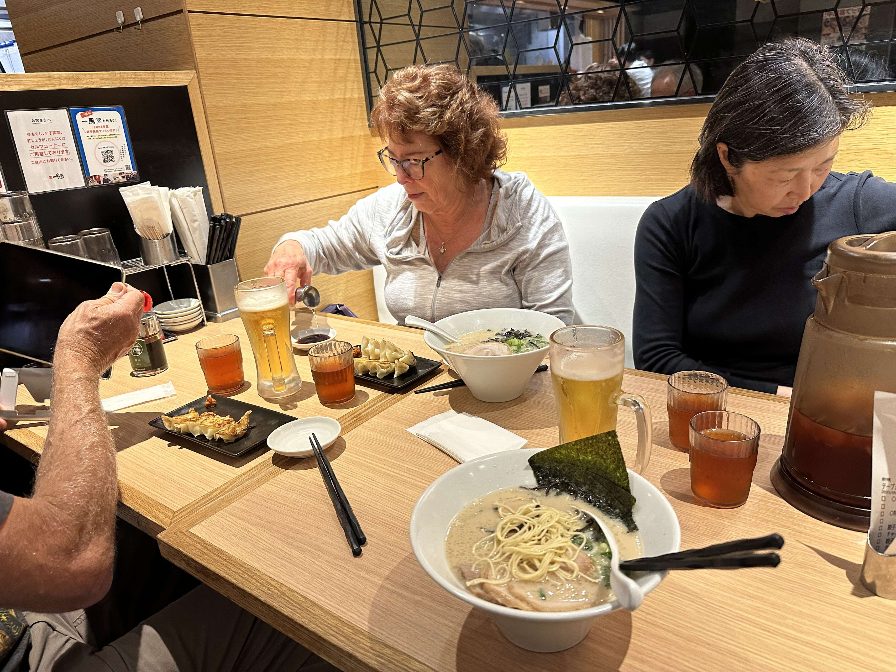
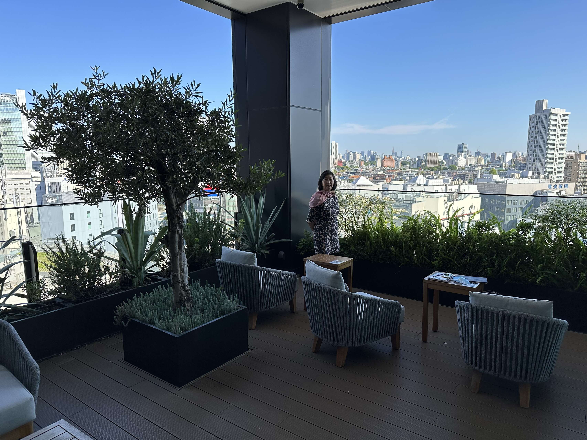

OK, here we go! I think this is the first three week vacation we’ve ever gone on,
in the past we’ve only had so much vacation available.

The Sunday morning drive to LAX was calm. We parked at the airport Hilton parking garage,
which had a clearance of 5’10”, so I had to duck all the way from the car to the elevator.
In the Hilton lobby were a couple of hundred teenage dancers milling about waiting for an audition.

Thumbs up for Japan Airlines Premium Economy. You get access to a peaceful lounge:

And the seats leave plenty of legroom for me:

Nice bundle of goodies with the seat, including slippers which of course don’t fit. The flight itself was uneventful.

The immigration line at Haneda airport was at least a thousand people and took a good hour to get through. There were signs up blaming the queue on the G-7 meeting next week. I had screen captured QR codes for immigration and customs forms, and that did work. No Covid screening or requirements.

Bill and Pam were waiting for us, which was really nice of them. They had landed at 5AM and were a bit tired, even after a few hours sleep at a love hotel. Bill and I spotted each other across the crowded hall right away – we have a height advantage (disadvantage). There were a few bobbles figuring out the train lines (I think we were tired), but a train agent at Shinagawa helped us out. We went out for ramen after the trip to Gotanda and checking in to the Mitsui Garden hotel. Warm soup and cold beer hit the spot.

The M-G is good. The bed and shower aren’t too small and the view is great:

The M-G also had guest slippers, standard tiny size. I anticipate this won’t be the end of complimentary too small slippers on this trip.

Breakfast is very eclectic, a mix of Italian and Japanese.
