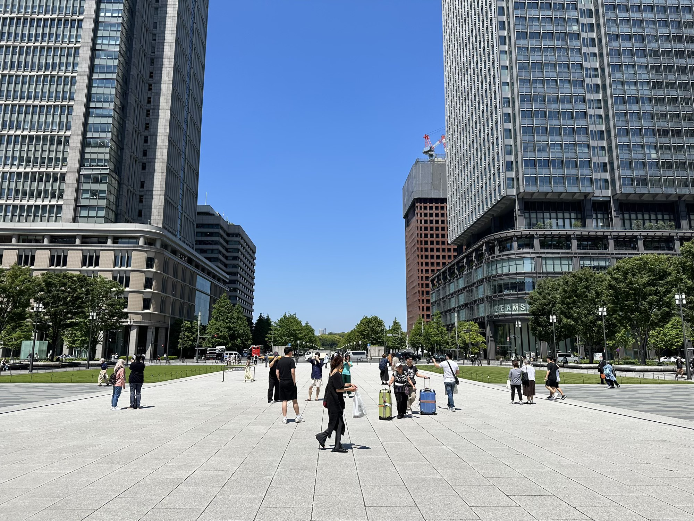
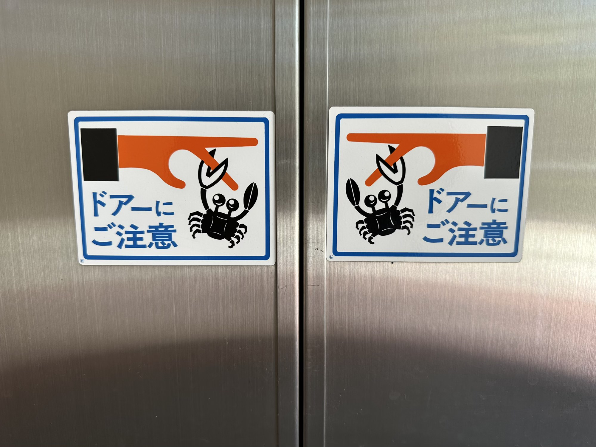
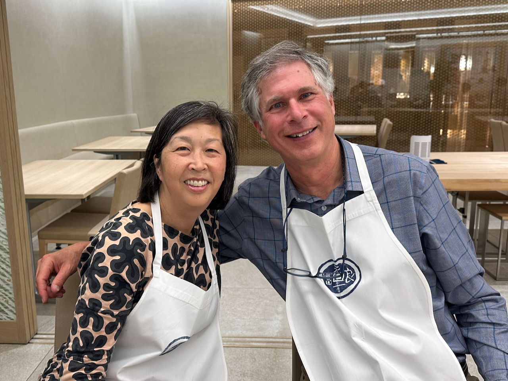
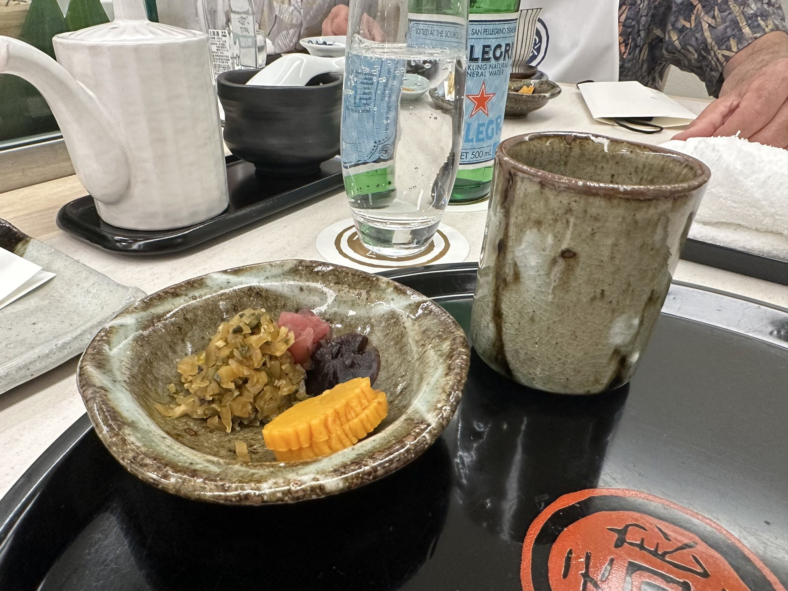
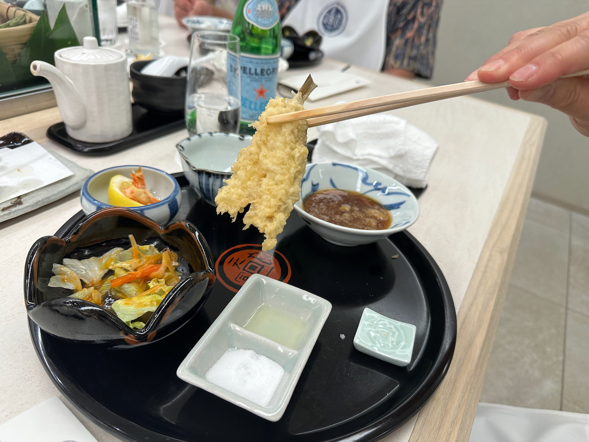
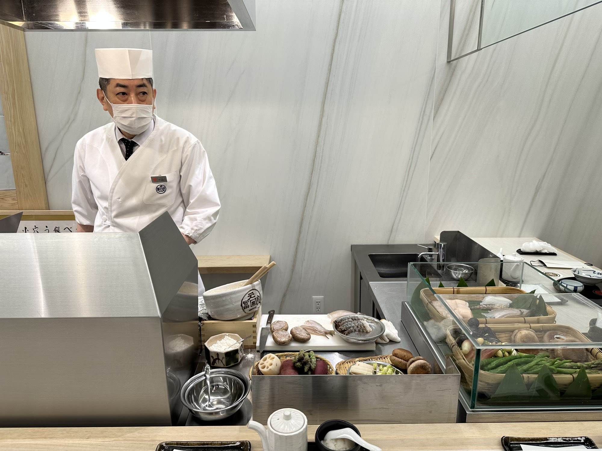

Day 2 started with a trip to Tokyo station in Ginza, where we exchanged our JR rail pass vouchers for actual
rail passes. That was a long line too. I think there are lots of foreigners visiting Japan, maybe more than
usual since they have opened up and removed restrictions.

Anyway, after that it was a nice stroll through the Ginza district. Our destination was the Peninsula Hotel,
where we had lunch reservations at a high end tempura restaurant.

I noticed these elevator doors along the way – nice use of crabs:

The tempura was delicious, best scallop I think I’ve had. They put bibs on us to keep us presentable.

They had one potter make most of the dishes:

Here’s our cook. He would plonk veggies and seafood in front of you as they were done.

